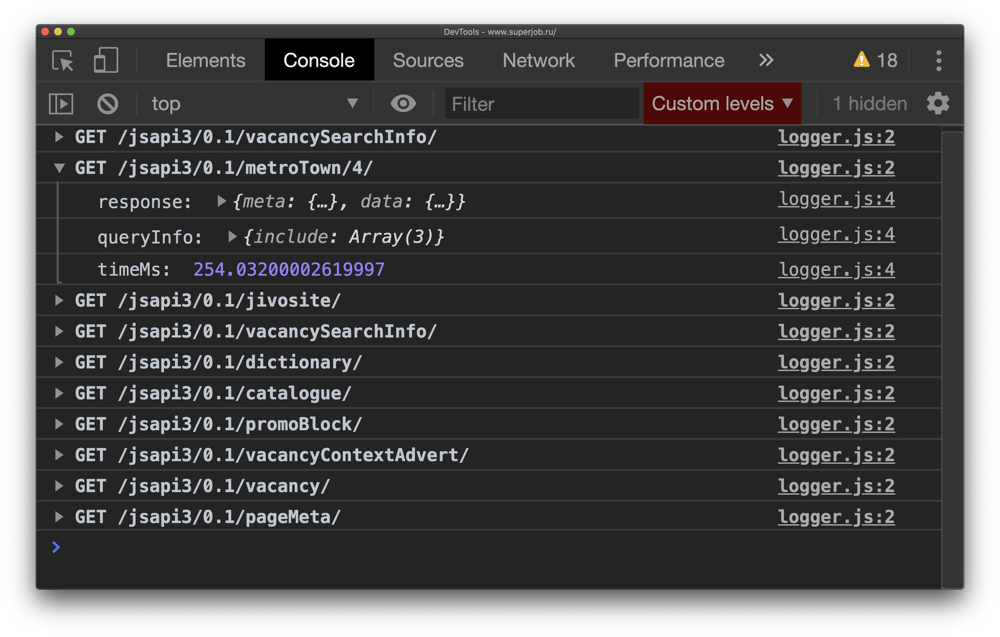

# JSON API debugger chrome extension 

JSON API is a specification for building APIs detailed at [JSONAPI.org.](https://jsonapi.org)

## Install

Install it from [Chrome Web Store](https://chrome.google.com/webstore/detail/json-api-debugger/cegnaocdodcebnffemedooiknbljkacl?hl=en-GB)

## Motivation

JSON API is quite verbose and it is hard to view big responses with many nested includes e.g. `include=foo.bar.baz`.

## Solution

It would be nice to view in console the deserialized structure of JSON API response. It is a simple object converted from JSON.

JSON API response

<pre>
{
  "data": [
    {
      "id": "1",
      "type": "town",
      "attributes": {
        "name": "Moscow"
      },
      "relationships": {
        "region": {
          "data": {
            "id": "2",
            "type": "region"
          }
        }
      }
    }
  ],
  "included": [
    {
      "id": "2",
      "type": "region",
      "attributes": {
        "name": "Moscow region"
      },
      "relationships": {
        "country": {
          "data": {
            "id": "3",
            "type": "country"
          }
        }
      }
    },
    {
      "id": "3",
      "type": "country",
      "attributes": {
        "name": "Russia"
      }
    }
  ]
}
</pre>

Deserialized structure

<pre>
{
  data: [
    {
      id: "1",
      type: "town",
      name: "Moscow",
      region: {
        id: "2",
        type: "region",
        name: "Moscow region",
        country: {
          id: "3",
          type: "country",
          name: "Russia"
        },
      }
    }
  ]
};
</pre>

## Supports

Google Chrome 60+

## Usage

1. [Install extension](https://chrome.google.com/webstore/detail/json-api-debugger/cegnaocdodcebnffemedooiknbljkacl?hl=en-GB)
2. Add rule (regexp) in options for your JSON API endpoint to catch it
3. View data in console (deserialized response, query info, etc.)

## Building for use

Download the source code 

1. Install dependencies `npm install`
2. Zip chrome extension `npm run build`

This will generate `json_api_debugger.zip` for use in Chromium browsers.
